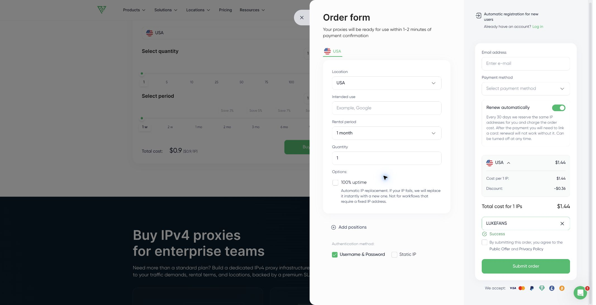

# Proxy-Seller静态住宅IP、ISP代理与优惠码指南（2026）

[English README](README.en.md) · [完整简体中文网页](https://lukevoidx.github.io/proxy-seller-guide/zh/) · [Full English page](https://lukevoidx.github.io/proxy-seller-guide/)

这是一份非官方、基于可核验证据的Proxy-Seller选购指南，重点解释以下关键词与产品之间的区别：

- **静态住宅IP／ISP代理**：由互联网服务商分配并保持稳定的住宅类IP，适合长期会话、固定地区身份、SEO监控和广告验证。
- **住宅代理**：来自真实用户IP池，支持国家、城市和ISP定位，以及按请求、时间或粘性会话轮换。
- **IPv4代理**：兼容性较广的静态数据中心代理。
- **IPv6代理**：地址空间大、成本较低，但购买前应确认目标网站支持IPv6。
- **移动代理**：来自4G／5G运营商网络，适合需要移动网络环境验证的任务。

## Proxy-Seller优惠码

| 优惠码 | 折扣 | 适用范围 | 有效期 |
| --- | ---: | --- | --- |
| `LUKE25` | 25% OFF（7.5折） | 所有产品，包括静态住宅IP、ISP、住宅、IPv4、IPv6和移动代理 | 2026年9月24日—10月8日 |
| `LUKEFANS` | 20% OFF（8折） | 所有产品，包括静态住宅IP、ISP、住宅、IPv4、IPv6和移动代理 | 永久有效，无到期日 |

[前往Proxy-Seller官网使用优惠码](https://proxy-seller.com/?partner=HZYX5AIJ16M74Y)

> 推广披露：通过页面链接购买或使用优惠码时，Luke可能获得佣金。请在付款前确认订单页面显示的实际减免金额。

## 商家结算页实测

测试日期：2026年9月24日。样本为美国IPv4、1个IP、1个月，未登录、付款前。

- `LUKE25`：$1.80 → $1.35，节省$0.45（25%）。
- `LUKEFANS`：$1.80 → $1.44，节省$0.36（20%）。

| LUKE25 | LUKEFANS |
| --- | --- |
|  |  |

## 如何选择Proxy-Seller代理

| 需求 | 优先考虑 | 原因 |
| --- | --- | --- |
| 固定住宅类IP、长期登录 | 静态住宅IP／ISP代理 | 地址稳定，并保留ISP网络属性 |
| 大量地区和IP轮换 | 住宅代理 | 支持地域定位和多种轮换方式 |
| 通用兼容、静态地址 | IPv4数据中心代理 | 网站兼容范围通常更广 |
| 成本敏感、目标支持IPv6 | IPv6代理 | 地址空间大，适合批量任务 |
| 需要移动运营商网络 | 移动代理 | 提供4G／5G网络环境 |

购买前应先用小订单测试自己的目标网站。价格会随代理类型、地区、数量、流量和租期变化，因此本仓库不保存容易过期的固定价格表。

## 优惠码使用方法

1. 在Proxy-Seller官网选择代理类型、国家或地区、数量和租期。
2. 在订单页面展开 **Have coupons?**。
3. 输入 `LUKE25` 或 `LUKEFANS` 并应用。
4. 确认页面显示 **Success**，且订单总额已经下降，再选择支付方式。

## 已确认的边界

- 两个优惠码均适用于所有产品。
- LUKEFANS永久有效，无到期日。
- LUKE25的日期为2026年9月24日至10月8日，具体截止时刻由商家决定。
- 没有单独验证续费、叠加、所有地区和所有产品组合。
- 本仓库不是Proxy-Seller官方仓库；规格、价格、库存和条款以官网为准。

## 资料来源

- [Proxy-Seller官方网站](https://proxy-seller.com/)
- [Proxy-Seller官方API文档](https://docs.proxy-seller.com/)
- [LukeVoidX优惠码页面](https://lukevoidx.com/zh/deals/proxy-seller)

完整英文说明见 [README.en.md](README.en.md)。
